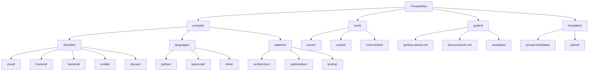

# 🚀 PromptAtlas - AI Development Prompt Navigator

<!-- Project Status -->

[](LICENSE)
[](https://github.com/BjornMelin/prompt-atlas/releases)
[](https://github.com/BjornMelin/prompt-atlas/commits)
[](https://github.com/BjornMelin/prompt-atlas/actions)

<!-- Community -->

[](https://github.com/BjornMelin/prompt-atlas/issues)
[](https://github.com/BjornMelin/prompt-atlas/pulls)
[](https://github.com/BjornMelin/prompt-atlas/graphs/contributors)
[](https://github.com/BjornMelin/prompt-atlas/stargazers)

A comprehensive collection of AI development prompts to enhance your coding workflow. PromptAtlas provides expert-level templates for various domains, languages, and AI tools to accelerate your development process.

## 📋 Table of Contents

- [🚀 PromptAtlas - AI Development Prompt Navigator](#-promptatlas---ai-development-prompt-navigator)
  - [📋 Table of Contents](#-table-of-contents)
  - [✨ Features](#-features)
  - [🚀 Getting Started](#-getting-started)
  - [📂 Repository Structure](#-repository-structure)
  - [📚 Prompt Categories](#-prompt-categories)
    - [🌐 Domain-Specific Prompts](#-domain-specific-prompts)
    - [💻 Language-Specific Prompts](#-language-specific-prompts)
    - [🧠 AI Tool Configurations](#-ai-tool-configurations)
  - [📋 How to Use Prompts](#-how-to-use-prompts)
  - [🤝 Contributing](#-contributing)
  - [📜 License](#-license)
  - [👨‍💻 Author](#-author)
  - [🙏 Acknowledgments](#-acknowledgments)

## ✨ Features

- 🎯 **Specialized Templates**: Carefully crafted prompts for different development scenarios
- 🏗️ **Architecture Patterns**: Best practices for modern software design
- ⚡ **Performance Optimization**: Templates focused on scalability and efficiency
- 🔒 **Security First**: Built-in security considerations for each template
- 🚀 **Cloud Native**: Deep integration with modern cloud services
- 📱 **Full Stack**: Coverage from frontend to backend to mobile
- 🤖 **AI Development**: Optimized workflows for AI-assisted development
- 🔄 **CI/CD**: Continuous integration and deployment templates
- 💻 **IDE Integration**: Custom rules for AI coding assistants like Cursor

## 🚀 Getting Started

1. **Choose Your Template**

   - Browse the repository by domain, language, or pattern
   - Select a prompt that matches your development needs
   - Follow the usage instructions in the prompt file

2. **Customize the Prompt**

   - Replace placeholders with your specific requirements
   - Add or remove sections as needed
   - Follow the examples provided in each template

3. **Use with Your AI Assistant**
   - Copy the customized prompt
   - Paste it into your AI assistant (ChatGPT, Claude, GitHub Copilot, etc.)
   - Iterate based on the results

## 📂 Repository Structure

PromptAtlas is organized to help you quickly find the prompts you need:



## 📚 Prompt Categories

### 🌐 Domain-Specific Prompts

- **Cloud Development**: AWS Lambda, serverless, cloud architecture
- **Frontend Development**: React, components, performance
- **Backend Development**: APIs, databases, microservices
- **Mobile Development**: React Native, Flutter, native apps
- **DevOps**: CI/CD pipelines, deployment, infrastructure

### 💻 Language-Specific Prompts

- **Python**: AI/ML engineering, optimization, best practices
- **TypeScript**: Next.js, React, modern web development
- **Other Languages**: Coming soon!

### 🧠 AI Tool Configurations

- **Cursor AI**: Agent frameworks and specialized rules
- **GitHub Copilot**: Optimization settings and templates
- **Chat Models**: Configurations for ChatGPT, Claude, etc.

## 📋 How to Use Prompts

Each prompt in PromptAtlas follows a standardized format:

1. **Description**: What the prompt helps you accomplish
2. **Use Cases**: Scenarios where the prompt is most useful
3. **Parameters**: Variables you should customize
4. **Example Usage**: How to adapt the prompt for your needs
5. **Expected Output**: What the AI assistant should produce
6. **Customization Guide**: Tips for adapting to specific scenarios

Example usage:

```markdown
I need to develop an AWS Lambda function for image processing with:

1. Function Specifications:

   - Runtime: Python 3.11
   - Memory: 1024 MB
   - Timeout: 30 seconds

2. Event Sources:

   - S3 bucket upload
   - Event pattern: _.jpg, _.png
   - DLQ for failed processing

3. Integration Points:
   - Input: S3 bucket
   - Output: Processed images to S3
   - Metadata: DynamoDB
```

## 🤝 Contributing

We welcome contributions to PromptAtlas! Here's how you can help:

1. **Add New Prompts**: Create templates for new domains or use cases
2. **Improve Existing Prompts**: Enhance clarity, add examples, fix issues
3. **Documentation**: Improve guides, add tutorials, create examples
4. **Share Your Experience**: Add case studies showing prompt effectiveness

See our [Contribution Guidelines](CONTRIBUTING.md) for detailed instructions.

## 📜 License

This project is licensed under the MIT License - see the [LICENSE](LICENSE) file for details.

## 👨‍💻 Author

**Bjorn Melin**  
AI/ML Leader · GenAI & LLM Expert · Cloud Architect & Full-Stack Developer

## 🙏 Acknowledgments

- All contributors who have helped improve these templates
- The AI/ML community for valuable feedback
- Open source projects that inspired this collection

<p align="center">Made with 🤖 by developers, for developers.</p>
