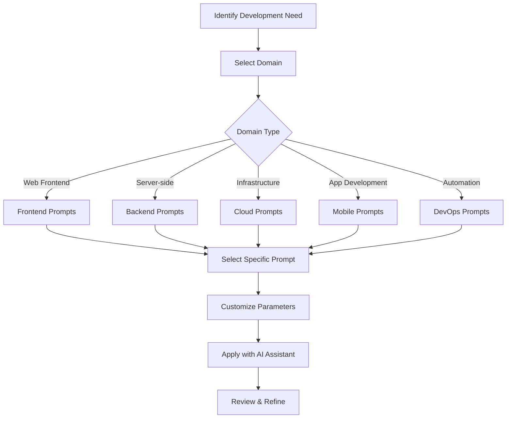

# 🌐 Domain-Specific Prompts

A curated collection of prompts organized by development domain, allowing you to quickly find templates tailored to specific areas of software development.

## 📋 Table of Contents

- [🌐 Domain-Specific Prompts](#-domain-specific-prompts)
  - [📋 Table of Contents](#-table-of-contents)
  - [🏢 Available Domains](#-available-domains)
  - [📂 Organization](#-organization)
  - [🛠️ Usage Flow](#️-usage-flow)
  - [🤝 Contributing](#-contributing)

## 🏢 Available Domains

- ☁️ **Cloud**: AWS Lambda, serverless architecture, cloud infrastructure design
- 🖥️ **Frontend**: React, components, performance optimization
- 🔌 **Backend**: APIs, databases, microservices
- 📱 **Mobile**: React Native, Flutter, native app development
- 🔄 **DevOps**: CI/CD, deployment automation, infrastructure as code

## 📂 Organization

Each domain subdirectory contains prompts specifically crafted for that area of development, with considerations for:

1. Domain-specific best practices
2. Common frameworks and technologies
3. Architecture patterns
4. Performance considerations
5. Security requirements

## 🛠️ Usage Flow

The domain-specific prompt selection and usage process is illustrated below:

## 🤝 Contributing

When adding new domain-specific prompts, please:

1. Use the standardized prompt template
2. Include domain-specific examples
3. Reference relevant technologies and frameworks
4. Consider scalability, performance, and security aspects
5. Add appropriate emojis and formatting for visual appeal
