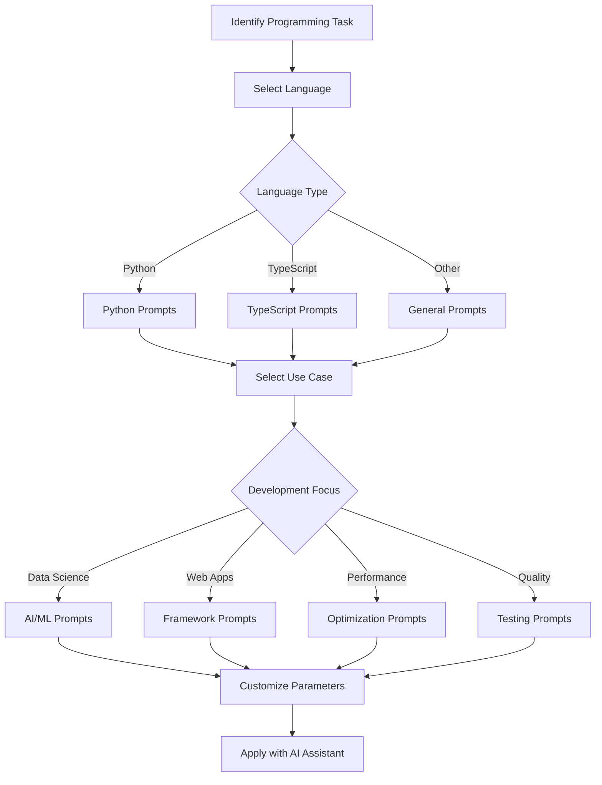

# 💻 Language-Specific Prompts

A comprehensive collection of prompts optimized for specific programming languages, helping you leverage AI assistants more effectively for language-specific tasks.

## 📋 Table of Contents

- [💻 Language-Specific Prompts](#-language-specific-prompts)
  - [📋 Table of Contents](#-table-of-contents)
  - [🔠 Available Languages](#-available-languages)
  - [📂 Organization](#-organization)
  - [🔄 Selection Process](#-selection-process)
  - [🛠️ Usage Guide](#️-usage-guide)
  - [🤝 Contributing](#-contributing)

## 🔠 Available Languages

- 🐍 **Python**: AI/ML engineering, data science, backend development, and optimization
- ⚡ **TypeScript**: Next.js, React, modern web development
- 🧩 **Other Languages**: Coming soon!

## 📂 Organization

Each language subdirectory contains prompts that have been crafted specifically for that language, considering:

1. Language idioms and best practices
2. Common frameworks and libraries
3. Optimization techniques
4. Testing patterns
5. Domain-specific implementations

## 🔄 Selection Process

The following diagram illustrates how to select the right language-specific prompt:

## 🛠️ Usage Guide

Choose the appropriate language directory based on your development needs and follow these steps:

1. Browse the language directory for your target language
2. Select a prompt that matches your specific use case
3. Customize the template with your specific requirements
4. Follow the standardized prompt format used throughout PromptAtlas

## 🤝 Contributing

When adding new language-specific prompts, please:

1. Use the standardized prompt template
2. Include examples specific to that language
3. Reference common libraries and frameworks for that language
4. Focus on language-specific optimization and best practices
5. Incorporate code examples that demonstrate best practices
