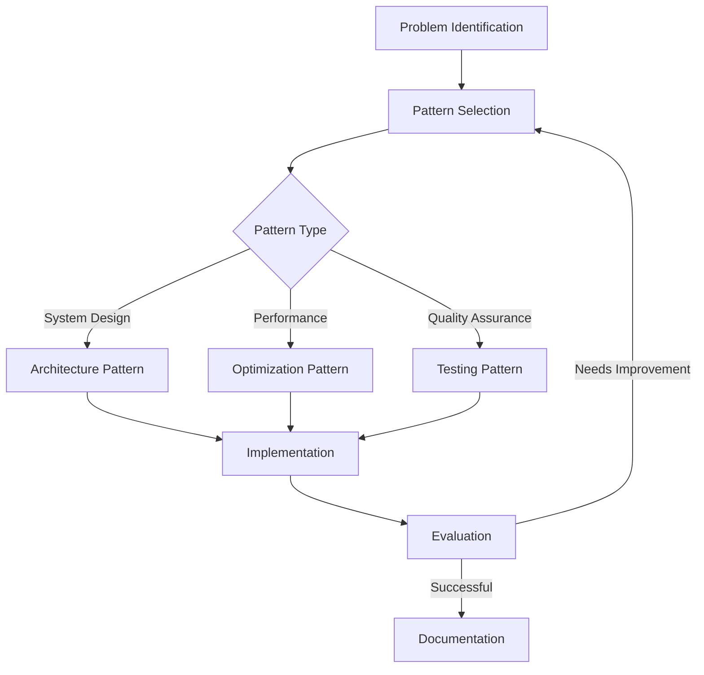

# 🧩 Prompt Patterns

A collection of reusable prompt patterns organized by category to help you solve common development challenges with AI.

## 📋 Table of Contents

- [🧩 Prompt Patterns](#-prompt-patterns)
  - [📋 Table of Contents](#-table-of-contents)
  - [📂 Categories](#-categories)
  - [🛠️ Usage Guide](#️-usage-guide)
  - [🔄 Patterns Flow](#-patterns-flow)
  - [🤝 Contributing](#-contributing)

## 📂 Categories

- 🏗️ **Architecture**: Patterns for system design and architecture decisions
- ⚡ **Optimization**: Patterns for performance optimization and efficiency
- 🧪 **Testing**: Patterns for comprehensive testing strategies and QA

## 🛠️ Usage Guide

Each pattern follows a standardized format that can be adapted to specific use cases:

1. Select the appropriate pattern category
2. Review the pattern documentation
3. Customize the parameters for your specific needs
4. Use with your preferred AI assistant

## 🔄 Patterns Flow

The relationship between different pattern types is illustrated below:

## 🤝 Contributing

To add new patterns:

1. Identify common challenges in your domain
2. Create a pattern that follows the standard format
3. Include clear examples and use cases
4. Submit a pull request with your contribution

Each pattern should include parameter placeholders, expected outputs, and customization guidance.
