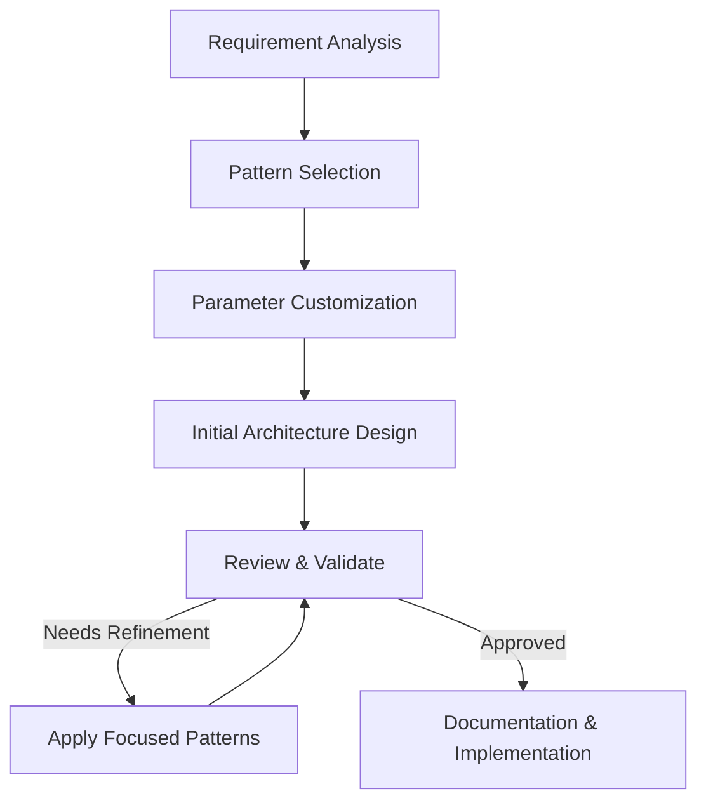

# 🏗️ Architecture Patterns

A collection of prompt patterns specifically designed for system architecture design and planning with AI assistants.

## 📋 Table of Contents

- [🏗️ Architecture Patterns](#️-architecture-patterns)
  - [📋 Table of Contents](#-table-of-contents)
  - [🎯 Purpose](#-purpose)
  - [📚 Available Patterns](#-available-patterns)
  - [🔄 Architecture Design Flow](#-architecture-design-flow)
  - [📝 Pattern Format](#-pattern-format)
  - [🤝 Contributing](#-contributing)

## 🎯 Purpose

Architecture patterns help you leverage AI to design robust, scalable, and maintainable system architectures. These patterns focus on:

- System component design
- Component interaction and communication
- Scalability considerations
- Performance optimization
- Security by design

## 📚 Available Patterns

This directory contains the following architecture patterns:

- **System Architecture Design**: Comprehensive system layout and component design
- **Service Integration**: Connecting multiple services and systems
- **API Design**: Creating robust and flexible APIs
- **Database Architecture**: Designing efficient database schemas and access patterns
- **Event-Driven Systems**: Building responsive event-based architectures

## 🔄 Architecture Design Flow

The following diagram illustrates the typical flow when using architecture patterns:

## 📝 Pattern Format

Each architecture pattern follows this structure:

1. **Pattern Name**: Clear identifier
2. **Problem Statement**: What the pattern solves
3. **Context Parameters**: Variables to customize
4. **Solution Structure**: Architectural approach
5. **Component Interactions**: How components communicate
6. **Quality Attributes**: Performance, security, scalability considerations
7. **Example Implementation**: Reference architecture

## 🤝 Contributing

To add new architecture patterns:

1. Identify common architectural challenges
2. Document the pattern using the standard format
3. Include diagrams and visual representations
4. Provide real-world examples when possible
