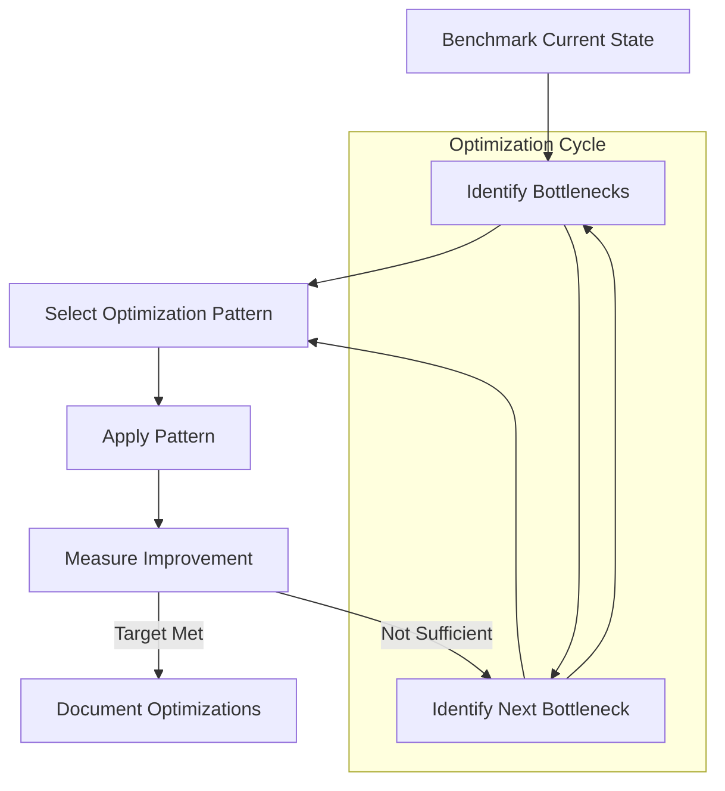

# ⚡ Optimization Patterns

A collection of prompt patterns for code and system optimization to help you achieve better performance, efficiency, and scalability.

## 📋 Table of Contents

- [⚡ Optimization Patterns](#-optimization-patterns)
  - [📋 Table of Contents](#-table-of-contents)
  - [🎯 Purpose](#-purpose)
  - [📚 Available Patterns](#-available-patterns)
  - [📊 Optimization Process](#-optimization-process)
  - [📝 Pattern Format](#-pattern-format)
  - [🤝 Contributing](#-contributing)

## 🎯 Purpose

Optimization patterns help you leverage AI to identify and implement performance improvements in your code and systems. These patterns focus on:

- Runtime performance improvements
- Memory usage optimization
- Network efficiency
- Resource utilization
- Algorithm optimization

## 📚 Available Patterns

This directory contains the following optimization patterns:

- **Performance Profiling**: Identifying performance bottlenecks
- **Algorithm Optimization**: Improving time and space complexity
- **Memory Management**: Reducing memory usage and leaks
- **Database Query Optimization**: Enhancing database performance
- **Frontend Performance**: Improving load times and rendering efficiency

## 📊 Optimization Process

The following diagram illustrates the typical flow when using optimization patterns:

## 📝 Pattern Format

Each optimization pattern follows this structure:

1. **Pattern Name**: Clear identifier
2. **Problem Statement**: What performance issue the pattern addresses
3. **Context Parameters**: Variables to customize
4. **Before Metrics**: How to measure current performance
5. **Optimization Approaches**: Techniques to improve performance
6. **After Metrics**: How to verify improvements
7. **Example Implementation**: Reference optimization

## 🤝 Contributing

To add new optimization patterns:

1. Identify common performance challenges
2. Document the pattern using the standard format
3. Include benchmark examples
4. Quantify expected improvements
5. Provide implementation examples in relevant languages
