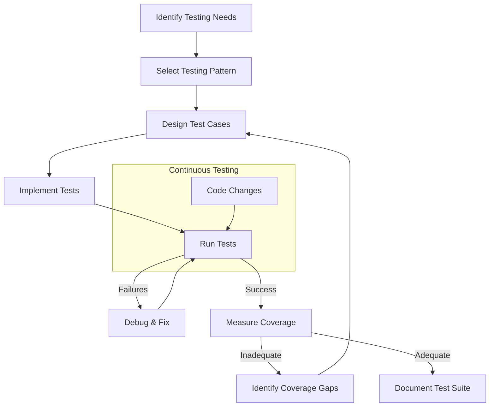

# 🧪 Testing Patterns

A collection of prompt patterns for effective testing strategies to help you build robust, reliable, and maintainable software.

## 📋 Table of Contents

- [🧪 Testing Patterns](#-testing-patterns)
  - [📋 Table of Contents](#-table-of-contents)
  - [🎯 Purpose](#-purpose)
  - [📚 Available Patterns](#-available-patterns)
  - [🔄 Testing Workflow](#-testing-workflow)
  - [📝 Pattern Format](#-pattern-format)
  - [🤝 Contributing](#-contributing)

## 🎯 Purpose

Testing patterns help you leverage AI to design and implement effective testing strategies for your software. These patterns focus on:

- Test coverage optimization
- Test case design
- Test automation
- Quality assurance processes
- Continuous integration

## 📚 Available Patterns

This directory contains the following testing patterns:

- **Unit Testing**: Testing individual components in isolation
- **Integration Testing**: Testing component interactions
- **End-to-End Testing**: Testing complete application workflows
- **Performance Testing**: Verifying system performance under load
- **Security Testing**: Identifying and addressing security vulnerabilities

## 🔄 Testing Workflow

The following diagram illustrates the typical flow when using testing patterns:

## 📝 Pattern Format

Each testing pattern follows this structure:

1. **Pattern Name**: Clear identifier
2. **Testing Objective**: What the pattern tests
3. **Context Parameters**: Variables to customize
4. **Test Case Design**: How to structure tests
5. **Test Implementation**: How to code the tests
6. **Coverage Criteria**: What constitutes adequate testing
7. **Example Implementation**: Reference test suite

## 🤝 Contributing

To add new testing patterns:

1. Identify common testing challenges
2. Document the pattern using the standard format
3. Include test case examples
4. Specify coverage expectations
5. Provide implementation examples in relevant languages and frameworks
