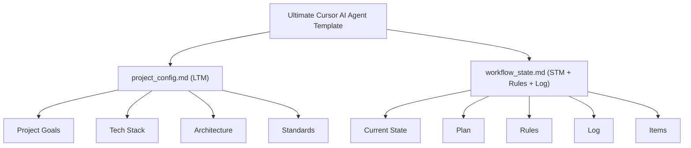
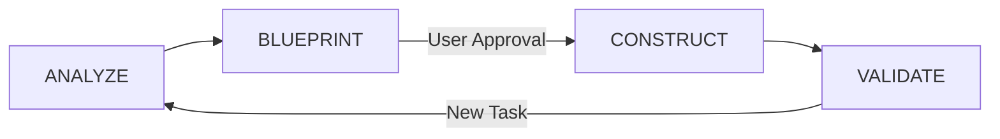

# 🤖 Ultimate Cursor AI Agent Prompt Template

## 📋 Table of Contents

- [🤖 Ultimate Cursor AI Agent Prompt Template](#-ultimate-cursor-ai-agent-prompt-template)
  - [📋 Table of Contents](#-table-of-contents)
  - [🔍 Overview](#-overview)
  - [✨ Key Features](#-key-features)
  - [📁 Files Included](#-files-included)
  - [🏗️ Core System Structure](#️-core-system-structure)
  - [🔄 Autonomous Loop Workflow](#-autonomous-loop-workflow)
  - [📊 Phase-Based Development](#-phase-based-development)
  - [📋 Implementation Instructions](#-implementation-instructions)
  - [🌟 Best Practices](#-best-practices)
  - [💼 Use Cases](#-use-cases)
  - [🤝 Contributing](#-contributing)

## 🔍 Overview

The Ultimate Cursor AI Agent Prompt Template provides a comprehensive framework for creating an autonomous, efficient, and consistent Cursor AI Agent for your development projects. This template combines structured software engineering principles with modern AI workflow optimization techniques to enhance your development experience.

This approach draws inspiration from the best practices established in both the [Bhartendu-Kumar/rules_template](https://github.com/Bhartendu-Kumar/rules_template) and [kleosr/cursorkleosr](https://github.com/kleosr/cursorkleosr) repositories, while simplifying and enhancing the workflow for greater autonomy and efficiency.

## ✨ Key Features

- **Autonomous Loop Workflow**: Continuous cycle of reading, interpreting, acting, and updating
- **Phase-Based Development**: Structured progression through Analyze, Blueprint, Construct, and Validate phases
- **Two-File System**: Simple yet powerful architecture using project_config.md and workflow_state.md
- **MCP Tool Integration**: Seamless integration with Sequential Thinking, search tools, and terminal commands
- **Iterative Processing**: Efficient handling of multiple items while maintaining context integrity
- **Memory Management**: Optimized context handling with Long-Term and Short-Term memory components
- **Software Engineering Principles**: Built on traditional software development best practices

## 📁 Files Included

This template contains the following files:

- **system_prompt.md**: Instructions for Cursor AI on how to operate with the two-file system
- **project_config.md**: Template for long-term project memory
- **workflow_state.md**: Template for dynamic workflow state tracking

## 🏗️ Core System Structure

The template is built around a **Two-File System**:

1. **`project_config.md`** - Long-Term Memory (LTM)

   - Contains stable project information
   - Defines project goals, tech stack, architecture, and standards
   - Serves as the project's "constitution"
   - Updated infrequently

2. **`workflow_state.md`** - Short-Term Memory (STM) + Rules + Log
   - Contains dynamic workflow information
   - Tracks current state, plan, and progress
   - Defines operational rules for each phase
   - Maintains action logs and processing results
   - Updated continuously during development

## 🔄 Autonomous Loop Workflow

The AI operates in a continuous cycle:

- **READ**: AI reads workflow_state.md to understand current context
- **INTERPRET**: AI determines actions based on state and rules
- **ACT**: AI executes actions using Cursor tools
- **UPDATE**: AI records actions and updates state
- **REPEAT**: Continues until task completion

## 📊 Phase-Based Development

Development follows a structured four-phase process:

- **ANALYZE**: Understand requirements thoroughly
- **BLUEPRINT**: Create detailed implementation plan
- **CONSTRUCT**: Execute plan with proper error handling
- **VALIDATE**: Test implementation against requirements

## 📋 Implementation Instructions

To implement this template in your project:

1. **Create File Structure**:

   - Create a `.cursor` directory in your project root
   - Inside `.cursor`, create a `rules` directory
   - Create the two files: `project_config.md` and `workflow_state.md`

2. **Configure Files**:

   - Fill in `project_config.md` with your project-specific details
   - Initialize `workflow_state.md` with the template structure

3. **Setup MCP Tools** (Optional but recommended):

   - Connect Sequential Thinking MCP for complex reasoning
   - Connect search tools for external information gathering
   - Configure any other MCP tools you need

4. **Start Your Cursor Session**:

   - Copy the System Prompt into your Cursor chat
   - Reference both files in your initial instruction

5. **Monitor Workflow**:
   - Watch as the AI progresses through the phases
   - Approve the plan before implementation
   - Review the logs and results as tasks are completed

## 🌟 Best Practices

1. **Be Specific**: Provide detailed information in `project_config.md` for better context
2. **Review Plans**: Always thoroughly review plans before approving implementation
3. **Clear Context**: For iterative tasks, ensure context clearing is working properly
4. **Regular Updates**: Keep `project_config.md` updated as your project evolves
5. **Multiple Tasks**: For parallel tasks, create separate directories with their own file pairs

## 💼 Use Cases

The Ultimate Cursor AI Agent Template is ideal for:

- **Complex Software Development**: Multi-component systems requiring careful planning
- **Team Projects**: Maintaining consistency across multiple developers
- **Iterative Tasks**: Processing multiple similar items efficiently
- **Code Generation**: Creating consistent, well-structured code
- **Project Analysis**: Breaking down and understanding existing codebases
- **Refactoring**: Systematically improving code quality

## 🤝 Contributing

Your contributions to improving this template are welcome! Please see the repository's [Contribution Guidelines](../../CONTRIBUTING.md) for details on how to submit enhancements or fixes.

---

Created with ❤️ as part of the [AI-Powered Development Prompts](https://github.com/BjornMelin/ai-powered-development-prompts) collection.
