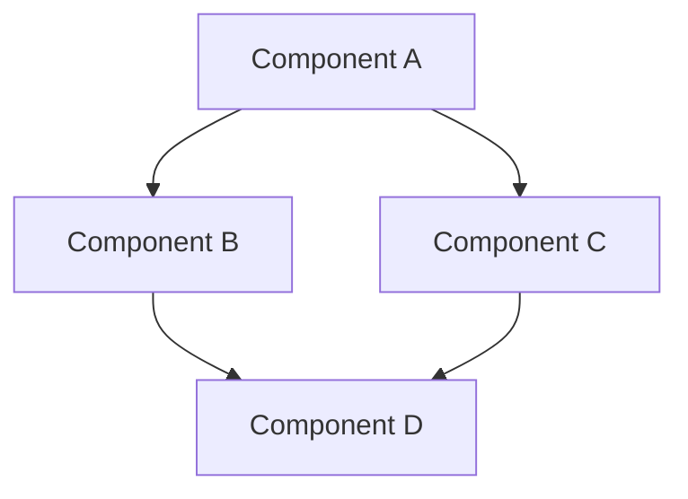

# Project Configuration (LTM)

This file contains the stable, long-term context for the project. It is read at the beginning of sessions and referenced when needed for critical decisions.

## Project Overview

### Project Name

[Project Name]

### Project Description

[Brief description of the project, its purpose, and goals]

### Key Objectives

- [Objective 1]
- [Objective 2]
- [Objective 3]

### Success Criteria

- [Criterion 1]
- [Criterion 2]
- [Criterion 3]

## Tech Stack

### Programming Languages

- [Language 1] - [Version]
- [Language 2] - [Version]

### Frameworks & Libraries

- [Framework 1] - [Version]
- [Framework 2] - [Version]
- [Library 1] - [Version]

### Development Environment

- [IDE/Editor]: [Cursor]
- [OS]: [OS Name]
- [Other Tools]: [List]

### Deployment Environment

- [Hosting/Deployment Solution]
- [CI/CD Pipeline]
- [Infrastructure Requirements]

## Architecture & Design

### System Architecture

[High-level description of the system architecture]



### Data Model

[Description of data entities and relationships]

### API Design

[Description of APIs, endpoints, and integrations]

## Standards & Conventions

### Coding Standards

- [Language-specific conventions]
- [Project-specific rules]
- [Error handling approaches]

### Naming Conventions

- [Files/Modules]: [Convention]
- [Classes/Components]: [Convention]
- [Functions/Methods]: [Convention]
- [Variables]: [Convention]

### Documentation Standards

- [Code documentation requirements]
- [External documentation approach]

## Project Structure

### Directory Organization

```plaintext
project-root/
├── src/             # Source code
├── tests/           # Test files
├── docs/            # Documentation
├── config/          # Configuration files
└── [Other directories...]
```

### Key Files

- [File 1]: [Purpose]
- [File 2]: [Purpose]

## Constraints & Considerations

### Performance Requirements

- [Response time expectations]
- [Throughput requirements]
- [Resource constraints]

### Security Requirements

- [Authentication approach]
- [Authorization strategy]
- [Data protection measures]

### Compatibility Requirements

- [Browser compatibility]
- [Device compatibility]
- [Other compatibility considerations]

## Tokenization Settings

### Characters Per Token (Estimation)

- [Average characters per token]: [Number]
- [Model context window]: [Number of tokens]

### Token Usage Strategy

- [Approach to managing token consumption]
- [Priority content for token allocation]
