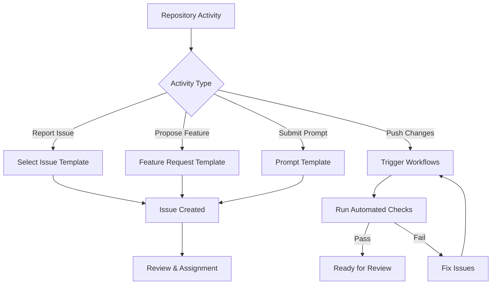

# 📝 GitHub Templates

A collection of standardized GitHub templates to streamline repository management and contribution processes.

## 📋 Table of Contents

- [📝 GitHub Templates](#-github-templates)
  - [📋 Table of Contents](#-table-of-contents)
  - [📂 Directory Structure](#-directory-structure)
  - [🔄 Usage Flow](#-usage-flow)
  - [📄 Available Templates](#-available-templates)
    - [Issue Templates](#issue-templates)
    - [Workflows](#workflows)
  - [🤝 Contributing](#-contributing)

## 📂 Directory Structure

```plaintext
github/
├── ISSUE_TEMPLATE/        # Issue templates
│   ├── bug_report.md      # Template for bug reports
│   ├── feature_request.md # Template for feature requests
│   └── prompt_template.md # Template for new prompt submissions
└── workflows/             # GitHub Actions workflows
    ├── markdown-lint.yml  # Markdown linting workflow
    └── mlc_config.json    # Markdown lint configuration
```

## 🔄 Usage Flow

The following diagram illustrates how these GitHub templates integrate into the repository workflow:



## 📄 Available Templates

### Issue Templates

- **Bug Report**: For reporting bugs with detailed reproduction steps
- **Feature Request**: For suggesting new features and improvements
- **Prompt Template**: Specifically for submitting new prompt templates

### Workflows

- **Markdown Lint**: Ensures consistent formatting of markdown files
- **Markdown Link Checker**: Validates that all links in documentation are working

## 🤝 Contributing

To improve these GitHub templates:

1. Follow the established format and style
2. Ensure templates are clear and easy to use
3. Update workflows to improve automation
4. Test templates before submitting changes

See the main [Contributing Guidelines](../../CONTRIBUTING.md) for more information.
