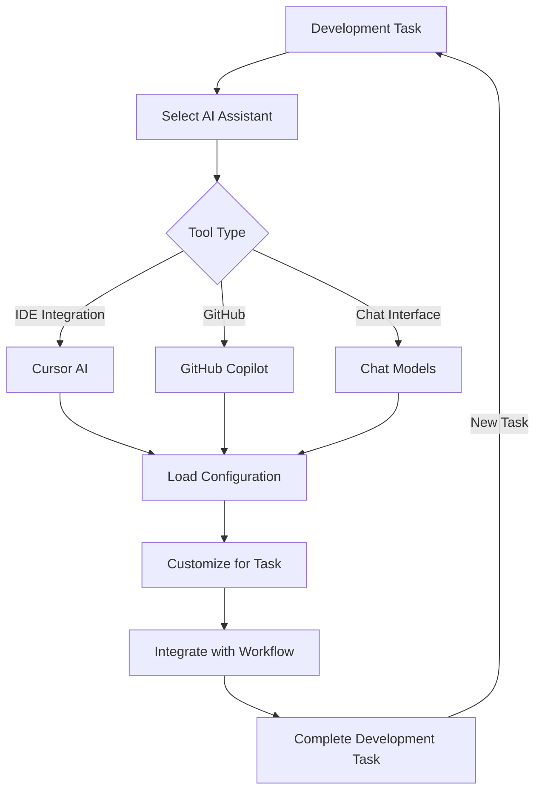

# 🛠️ AI Assistant Tools

A collection of configurations and prompts for various AI coding assistants and tools to enhance your development workflow.

## 📋 Table of Contents

- [🛠️ AI Assistant Tools](#️-ai-assistant-tools)
  - [📋 Table of Contents](#-table-of-contents)
  - [🤖 Available Tools](#-available-tools)
  - [📂 Organization](#-organization)
  - [🔄 Integration Flow](#-integration-flow)
  - [🛠️ Usage Guide](#️-usage-guide)
    - [Cursor AI Agent](#cursor-ai-agent)
    - [GitHub Copilot](#github-copilot)
    - [Chat Models](#chat-models)
  - [🤝 Contributing](#-contributing)

## 🤖 Available Tools

- 🖥️ **Cursor AI**: Agent frameworks and specialized rules for Cursor AI coding assistant
- 🚀 **GitHub Copilot**: Optimization settings and custom instructions for GitHub Copilot
- 💬 **Chat Models**: Configurations for ChatGPT, Claude, and other LLM chat interfaces

## 📂 Organization

The tools directory is organized by AI assistant platform:

```plaintext
tools/
├── cursor/              # Cursor AI coding assistant
│   └── agent/           # Autonomous AI agent framework
│       └── system_prompt.md
├── chat-models/         # ChatGPT, Claude, etc.
│   └── prompt-engineering/
│       └── master-prompt-generator.md
└── README.md            # This file
```

Each tool subdirectory contains configurations optimized for different development scenarios.

## 🔄 Integration Flow

The following diagram illustrates how these tools integrate into your development workflow:



## 🛠️ Usage Guide

To use these AI assistant configurations:

1. Select the appropriate tool for your development environment
2. Follow the specific installation and setup instructions in each tool's directory
3. Apply the configurations or prompts to your AI assistant
4. Customize as needed for your specific project requirements

### Cursor AI Agent

The Cursor AI Agent provides an autonomous development framework that can:

- Plan and manage complex development tasks
- Maintain context across multiple files
- Execute iterative processing with proper state management
- Provide detailed documentation and feedback

### GitHub Copilot

The GitHub Copilot configurations help you:

- Get more accurate and relevant code suggestions
- Customize Copilot's behavior for specific coding tasks
- Optimize pair programming workflows with AI
- Implement consistent coding patterns

### Chat Models

The chat model configurations include:

- Advanced prompt engineering techniques
- Specialized system messages
- Task-specific prompt templates
- Optimization strategies for different models

## 🤝 Contributing

When adding new AI assistant tools or configurations:

1. Create a properly structured directory for the tool
2. Include clear documentation on setup and usage
3. Provide examples of the tool in action
4. Highlight specific use cases where the tool excels
5. Reference the official documentation where appropriate

See our [Contribution Guidelines](../CONTRIBUTING.md) for detailed instructions.
